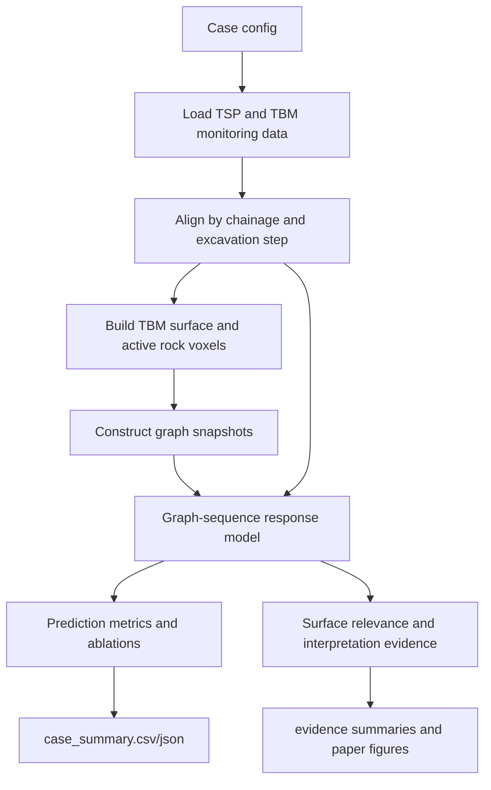

# Experiment Pipeline Diagram

This note summarizes the current data and algorithm flow. The runnable entry
point for formal experiments is `scripts/run_graph_sequence_case.py`.

## Case Entries

| Case | Config | Main output |
|---|---|---|
| BSLL DyK1017+205, one-step | `config/bsll_dyk1017_205.yaml` | `outputs/bsll_dyk1017_205/` |
| BSLL DyK1017+205, three-step | `config/bsll_dyk1017_205_h3.yaml` | `outputs/bsll_dyk1017_205_h3/` |
| SJLS Dyk1252+411 | `config/sjls_dyk1252_411.yaml` | `outputs/sjls_dyk1252_411/` |

## Core Modules

| Responsibility | Files |
|---|---|
| Data loading and alignment | `src/data/` |
| Graph construction | `src/graph/` |
| Models and baselines | `src/models/` |
| Training and metrics | `src/training/` |
| Figures and interpretation maps | `src/visualization/` |

## Evidence Flow

1. Run the case configs with `scripts/run_graph_sequence_case.py`.
2. Summarize predictive results with `scripts/summarize_case_results.py`.
3. Collect post-hoc interpretation evidence with `scripts/collect_evidence.py`.
4. Summarize interpretation evidence with
   `scripts/summarize_interpretation_evidence.py`.
