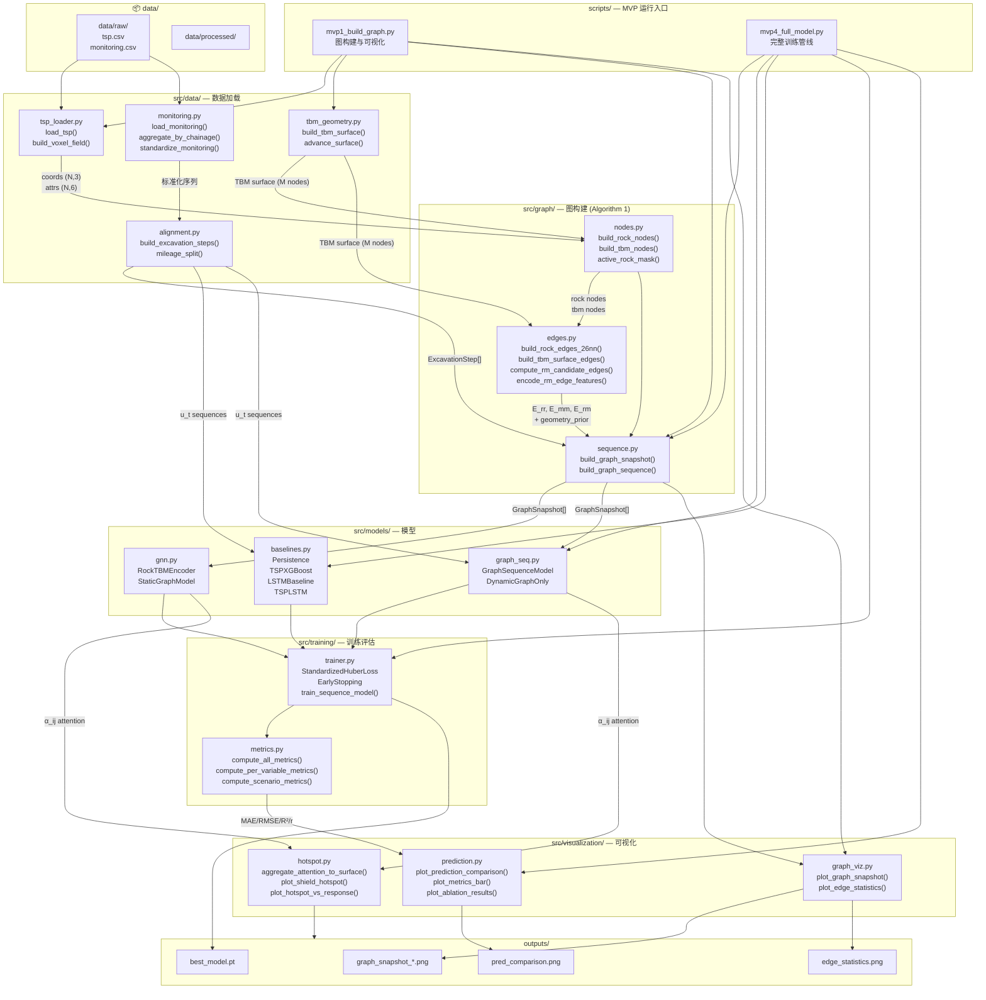
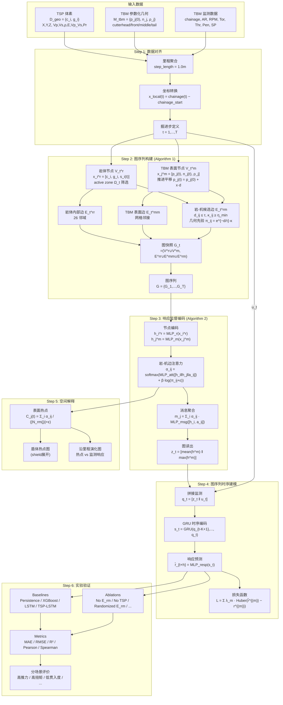

# 实验管线：模块关系图与数据流图

## 一、代码模块关系图

---

## 二、算法数据流图（对应论文 Algorithm 1 & 2）

---

## 三、文件 ↔ 论文章节映射

| 论文章节 | 对应代码文件 | 关键函数 |
|---|---|---|
| 3.1 Geometry-constrained graph construction | `src/graph/sequence.py` | `build_graph_sequence()` |
| 3.1 岩体节点 | `src/graph/nodes.py` | `build_rock_nodes()` |
| 3.1 TBM 节点 | `src/graph/nodes.py` | `build_tbm_nodes()` |
| 3.1 候选边生成 | `src/graph/edges.py` | `compute_rm_candidate_edges()` |
| 3.1 边特征 + 几何先验 | `src/graph/edges.py` | `encode_rm_edge_features()` |
| 3.2 GNN 边注意力 | `src/models/gnn.py` | `RockTBMEncoder.forward()` |
| 3.2 图序列 GRU | `src/models/graph_seq.py` | `GraphSequenceModel.forward()` |
| 3.2 训练目标 | `src/training/trainer.py` | `StandardizedHuberLoss` |
| 3.3 表面热点映射 | `src/visualization/hotspot.py` | `aggregate_attention_to_surface()` |
| 4.3-4.5 Baseline + 消融 | `src/models/baselines.py` | `LSTMBaseline`, `TSPXGBoost` |
| 4.5 分场景评价 | `src/training/metrics.py` | `compute_scenario_metrics()` |
| 4.6 空间解释可视化 | `src/visualization/` | `plot_shield_hotspot()`, `plot_hotspot_vs_response()` |
