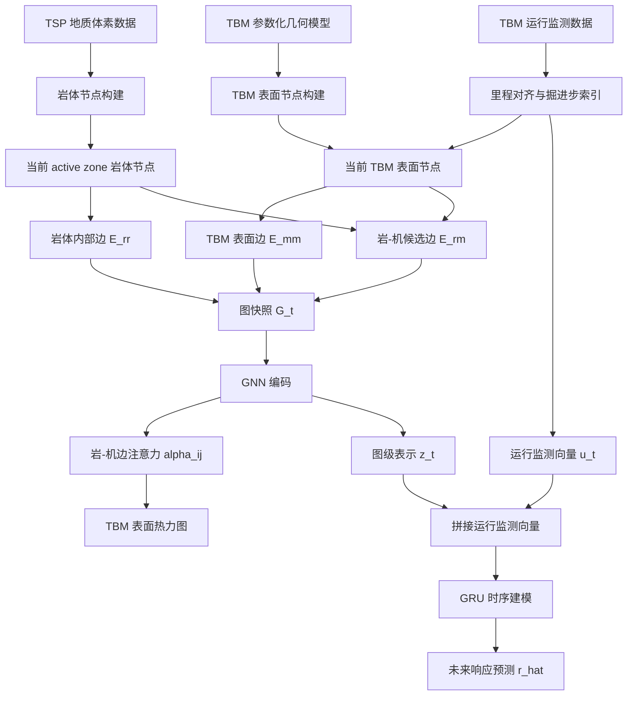

# 响应监督的几何约束岩–机交互图序列框架：论文提纲、引用逻辑、核心算法与实验设计

> 目标期刊导向：IJGIS / IJDE / GSIS  
> 论文定位：不是单纯 TBM 参数预测模型，而是**空间显式岩–机交互图表示方法**；监测响应预测是验证图表示有效性的功能性任务。

---

## 0. 一句话总方案

本文构建一种**响应监督的几何约束岩–机交互图序列框架**。首先，将 TSP 地质体素和 TBM 刀盘/护盾表面转化为异构图节点；其次，用距离、法向一致性、主动区和开挖状态构建几何合理的岩–机候选边；然后，以连续 TBM 监测响应作为监督信号，让 GNN 学习候选岩–机边对未来响应变化的相对贡献；最后，将学习到的交互相关性映射回盾体表面和里程空间，形成响应一致性的交互热点与图序列演化解释。

核心边界：

- 不把边权解释为真实接触力、接触压力或摩阻力。
- 不依赖稀缺卡机标签作为主监督信号。
- 不把论文写成“又一个 TBM 参数预测模型”。
- 不让 GNN 任意生成岩–机边；GNN 只在几何筛选后的候选边中学习相对重要性。
- 图序列表达的是 TBM 推进导致的岩–机候选关系重构，不是地质体本身动态变化。

---

## 1. 拟定题目

### 题目方案 A：稳健型

**A Response-Supervised Geometry-Constrained Graph Sequence Framework for Spatially Explicit Rock–TBM Interaction Representation**

适合强调方法严谨性和空间表达。

### 题目方案 B：GIS / Digital Earth 取向

**Spatially Explicit Rock–TBM Interaction Graph Sequences for Response-Consistent Interpretation of TBM Excavation Processes**

适合强调空间过程表达和解释。

### 题目方案 C：保留工程风险背景

**A Geometry-Constrained Graph Sequence Framework for Response-Consistent Rock–TBM Interaction Analysis toward Jamming-Risk Interpretation**

适合在摘要和引言中保留卡机风险应用场景，但正文不强行做风险标签预测。

---

## 2. 摘要逻辑提纲

### 第 1 句：问题背景

TBM 掘进响应通常被建模为监测时间序列，但这种表达难以说明岩体空间结构、TBM 部件位置和局部岩–机关系如何共同影响响应变化。

### 第 2 句：现有不足

已有 TBM 参数预测、风险预警和时间序列模型能够利用历史监测数据，但通常缺少对“哪里发生作用、作用于哪个部件、关系如何沿里程演化”的空间显式表达。

### 第 3 句：本文方法

本文提出响应监督的几何约束岩–机交互图序列框架，将 TSP 地质体素表示为岩体节点，将 TBM 刀盘和护盾表示为表面节点，并通过几何约束构建候选岩–机边。

### 第 4 句：学习机制

与直接使用人工权重或稀缺卡机标签不同，本文使用连续监测响应作为监督信号，学习几何筛选后岩–机候选边的响应一致性交互相关性。

### 第 5 句：空间解释

学习得到的边重要性进一步投影回 TBM 表面和里程空间，形成盾体热点图、局部截面图和沿里程演化图。

### 第 6 句：实验验证

通过与监测序列模型、TSP 增强序列模型、表格模型、静态图模型和结构消融模型对比，验证图结构、几何约束、TSP 属性和图序列演化的贡献。

### 第 7 句：意义

该框架将地质感知、机器几何、运行响应和空间解释统一到图序列表达中，为数字隧道和地下工程过程分析提供可计算、可学习、可解释的数据组织方法。

---

## 3. 引言提纲与引用逻辑

### 3.1 第一段：工程背景与问题引入

**段落目标：**说明 TBM 卡机/异常响应不是单一指标问题，而是地质条件、机器结构和运行过程共同作用的结果。

**应写内容：**

- TBM 广泛用于长大深埋隧道。
- 复杂地质条件下，软弱破碎围岩、富水带、高地应力和局部变形会改变 TBM 与围岩的相互作用状态。
- 推力、扭矩、贯入度、掘进速率、盾体压力等监测响应是岩–机作用的外在表现。
- 但仅从监测曲线看，难以判断异常响应对应的岩体位置和 TBM 部件。

**引用逻辑：**

- 引用 TBM 卡机、挤压地层、复杂地质条件下 TBM 风险研究。
- 可放 Hasanpour et al.、Nie et al.、Wang et al.、Katuwal et al. 等 TBM 卡机/风险预警相关文献。

**写作边界：**

- 不要一上来讲 GNN。
- 不要直接说现有方法“无效”，只说它们在空间显式表达方面不足。

---

### 3.2 第二段：数据条件变化——从缺数据到难组织

**段落目标：**引出 GIS / Digital Earth 关注的数据组织问题。

**应写内容：**

- TSP、超前地质预报、地质素描和 TBM 监测系统提供了多源数据。
- TSP 提供前方或邻近岩体三维属性场，TBM 监测提供沿里程的运行响应。
- 这些数据具有不同的空间支撑、时间分辨率和物理含义。
- 因此，问题不只是获取数据，而是如何把多源异构数据组织成保持空间结构和掘进演化的信息表达。

**引用逻辑：**

- 引用 TSP / advance geological prediction / TBM monitoring / digital tunnelling / digital twin 相关文献。
- 这里可以引 GIS / Digital Earth 中“多源数据融合、时空数据组织、数字孪生表达”类文献。

**写作边界：**

- 不要说 TSP 直接等于风险标签。
- TSP 只能作为地质空间上下文或岩体属性来源。

---

### 3.3 第三段：现有 TBM 预测模型的优势与不足

**段落目标：**自然引出为什么不能只用 LSTM / Transformer / XGBoost。

**应写内容：**

- 表格模型和时间序列模型已广泛用于预测贯入度、推力、扭矩和掘进速率。
- 这些模型对监测序列依赖关系有较强建模能力。
- 但它们通常将掘进过程表达为有序特征表或监测序列。
- 因此，难以显式保留岩体空间位置、TBM 部件结构和局部岩–机候选关系。

**引用逻辑：**

- 引用 TBM penetration rate prediction、thrust/torque forecasting、LSTM/TCN/Transformer、XGBoost 等文献。
- 这里不是为了否定它们，而是为了说明本文与它们的任务定位不同。

**推荐表述：**

> Sequence models are effective for learning temporal dependence in monitoring records, but they usually treat excavation as an ordered signal sequence rather than a spatially structured interaction process.

---

### 3.4 第四段：图模型与空间结构学习的机会

**段落目标：**引出图结构表示的合理性。

**应写内容：**

- 图模型适合表达不规则空间对象及其关系。
- 在物体交互、网格动力学、粒子系统和接触式物理场景中，图网络已经显示出表达关系和传播状态的能力。
- TBM 掘进场景天然具有“岩体单元—机器部件—局部关系”的对象关系结构。
- 因此，可以把岩体体素、TBM 表面和岩–机候选关系组织成异构图。

**引用逻辑：**

- 引用 Interaction Networks、Learning to Simulate Complex Physics with Graph Networks、MeshGraphNets、Graph Network / GNN physics simulation 等。
- 引用 TBM 领域已有 GCN / attention-based graph convolution for performance prediction 文献。

**写作边界：**

- 不要说这些图网络已经解决 TBM 岩–机作用问题。
- 只能说它们提供了关系建模启发，但 TBM 具体场景需要结合地质体素、机器几何和几何约束边构建。

---

### 3.5 第五段：科学问题

**段落目标：**明确本文不是普通预测，而是空间显式表示与响应一致性学习。

**建议科学问题：**

1. 如何将 TSP 岩体空间属性、TBM 表面结构和候选岩–机关系统一表达为动态图序列？
2. 如何在不依赖稀缺卡机标签的情况下，利用连续监测响应学习岩–机候选关系的重要性？
3. 如何将学习到的响应相关关系重新映射回 TBM 表面和里程空间，用于空间解释？

---

### 3.6 第六段：贡献

建议贡献写成四条：

1. **空间表示贡献**：提出岩体体素—TBM 表面—岩–机候选边的异构图序列表达。
2. **几何约束贡献**：提出基于距离、法向一致性、主动区和开挖状态的候选岩–机边构建方法。
3. **响应监督贡献**：利用连续 TBM 监测响应学习候选岩–机边的相对重要性，避免依赖稀缺风险标签和主观权重。
4. **空间解释贡献**：将学习到的交互相关性映射回盾体表面和里程空间，形成响应一致性的热点与演化解释。

---

## 4. 相关工作提纲与引用逻辑

不建议写过长 Related Work。可分为 3 个小节。

### 4.1 TBM risk assessment and monitoring-response prediction

**要点：**

- 地质分区、专家规则和概率模型用于风险评估。
- LSTM、TCN、Transformer、XGBoost 等用于 TBM 参数预测。
- 不足：多数方法以表格或序列为主要表达，空间结构解释弱。

**引用类型：**

- TBM jamming risk prediction。
- TBM penetration / thrust / torque prediction。
- Multi-source monitoring / geological prediction for TBM。

---

### 4.2 Graph learning for spatial and physical interaction systems

**要点：**

- 图网络适合处理对象关系、接触关系、网格关系和物理系统状态传播。
- 这些研究为“对象—关系—状态更新”提供方法启发。
- 但 TBM 场景中的边必须服从工程几何约束，不能纯黑箱连边。

**引用类型：**

- Interaction Networks。
- Graph Networks for physics simulation。
- MeshGraphNets。
- GNN for irregular spatial systems。

---

### 4.3 Spatially explicit interpretation and digital tunnelling analytics

**要点：**

- GIS / Digital Earth 关注复杂工程过程的空间组织、时空演化和可视解释。
- 本文不是只给预测值，而是把学习结果投影回空间场景。
- 图到场景的解释是区别于普通 TBM 预测论文的关键。

**引用类型：**

- Digital twin tunnelling。
- Spatial data integration / visual analytics。
- Digital Earth / underground space data organization。

---

## 5. 方法部分总结构

建议方法部分控制为 3 个主小节。

```text
3. Methodology
  3.1 Geometry-constrained rock–TBM graph sequence construction
  3.2 Response-supervised interaction learning
  3.3 Graph-to-surface spatial interpretation
```

### 5.1 总体方法流程图



方法主线为：

```text
几何约束限定候选交互空间
-> 响应预测任务监督 GNN 学习岩-机边相关性
-> GRU 建模图序列演化
-> 边注意力映射回 TBM 表面形成空间解释结果
```

---

## 6. 核心方法算法 1：几何约束岩–机图序列构建

### 6.1 输入

- TSP 地质体素场：

```text
D_geo = {c_i, g_i}
```

其中：

```text
c_i = (x_i, y_i, z_i)
g_i = [Vp_i, Vs_i, E_i, Vp/Vs_i, Pr_i, rho_i]
```

- TBM 表面模型：

```text
M_TBM = {p_j(0), n_j, rho_j}
```

其中：

```text
p_j：表面点坐标
n_j：表面法向
rho_j：部件标签，取 cutterhead / front shield / middle shield / tail shield
```

- 掘进过程参数：

```text
advance direction d
step length Δx
active zone Ω_t
interaction distance threshold τ
normal compatibility threshold η_min
```

---

### 6.2 输出

每个里程步输出一个图快照：

```text
G_t = (V_t^r ∪ V_t^m, E_t^rr ∪ E_t^mm ∪ E_t^rm)
```

并形成图序列：

```text
G = {G_1, G_2, ..., G_T}
```

---

### 6.3 图节点定义

岩体节点：

```math
x_i^r(t) = [c_i, g_i, s_i(t)]
```

其中 `s_i(t)` 表示该体素是否尚未被开挖。

TBM 表面节点：

```math
x_j^m(t) = [p_j(t), n_j(t), \rho_j]
```

TBM 平移更新：

```math
p_j(t+1) = p_j(t) + \Delta x d
```

---

### 6.4 图边定义

岩体内部边：

```text
E^rr：岩体 26 邻域边
```

TBM 表面边：

```text
E^mm：TBM 表面采样网格邻接边
```

岩–机候选边：

```math
e_{ij}^{rm}(t)=1
```

当且仅当：

```math
\begin{cases}
d_{ij}(t) \le \tau, \\
\kappa_{ij}(t) \ge \eta_{min}, \\
c_i \in \Omega_t, \\
s_i(t)=1.
\end{cases}
```

其中：

```math
d_{ij}(t)=\|c_i-p_j(t)\|
```

```math
\kappa_{ij}(t)=\max\left(0,\frac{n_j(t)^T(c_i-p_j(t))}{d_{ij}(t)+\epsilon}\right)
```

---

### 6.5 白话解释

这一步只解决“哪些岩体点和 TBM 表面点有资格发生候选交互”。

- 距离阈值保证空间邻近。
- 法向一致性避免穿过隧道空洞或背向连边。
- 主动区保证只处理当前 TBM 附近岩体。
- 开挖状态保证已开挖岩体不会继续参与当前图。

这一步不是学习模型，而是确定性构图算法。

---

### 6.6 Algorithm 1 伪代码

```text
Algorithm 1. Geometry-constrained rock–TBM graph sequence construction

Input:
  TSP voxel field D_geo = {c_i, g_i}
  TBM surface model M_TBM = {p_j(0), n_j, rho_j}
  chainage steps t = 1,...,T
  advance direction d
  step length Δx
  active zone Ω_t
  distance threshold τ
  normal threshold η_min

Output:
  graph sequence {G_1, G_2, ..., G_T}

For each excavation step t:
  1. Update TBM surface position p_j(t).
  2. Select unexcavated rock voxels in active zone Ω_t.
  3. Create rock nodes V_t^r with features [c_i, g_i, s_i(t)].
  4. Create TBM surface nodes V_t^m with features [p_j(t), n_j(t), rho_j].
  5. Construct rock–rock edges E_t^rr using 26-neighbourhood adjacency.
  6. Construct TBM–TBM edges E_t^mm using surface neighbourhood adjacency.
  7. Use KDTree to find rock–TBM node pairs satisfying d_ij ≤ τ.
  8. Compute signed-normal compatibility κ_ij.
  9. Retain rock–machine candidate edges satisfying κ_ij ≥ η_min and s_i(t)=1.
 10. Mark newly excavated rock voxels as inactive.
 11. Save graph snapshot G_t.
Return graph sequence {G_t}.
```

---

## 7. 核心方法算法 2：响应监督的交互图学习

### 7.1 任务定义

不用卡机标签。使用未来监测响应作为监督信号。

输入：

```text
past graph sequence: G_{t-K+1:t}
past monitoring sequence: u_{t-K+1:t}
```

输出：

```text
future response: r_{t+h}
```

形式为：

```math
\hat r_{t+h}=f_\Theta(G_{t-K+1:t}, u_{t-K+1:t})
```

其中：

```math
u_t = [Thrust_t, Torque_t, Penetration_t, AdvanceRate_t, RPM_t, ShieldPressure_t]
```

```math
r_{t+h} = [Thrust_{t+h}, Torque_{t+h}, Penetration_{t+h}, AdvanceRate_{t+h}]
```

---

### 7.2 边特征组织

岩–机边特征不应写成随意拼接，而应按三类组织：

```math
a_{ij}^{rm}=[a_{ij}^{geo}, a_i^{rock}, a_j^{comp}]
```

几何特征：

```math
a_{ij}^{geo}=[d_{ij}/\tau, \kappa_{ij}, (c_i-p_j)/\tau]
```

岩体属性：

```math
a_i^{rock}=g_i=[Vp_i, Vs_i, E_i, Vp/Vs_i, Pr_i, rho_i]
```

部件语义：

```math
a_j^{comp}=onehot(\rho_j)
```

---

### 7.3 几何先验

```math
\pi_{ij}^{rm}=\exp(-d_{ij}/\tau)\cdot \kappa_{ij}
```

解释：

- 距离越近，先验越高。
- 法向越一致，先验越高。
- 该先验不是接触力，不是接触压力，不是卡机概率。

---

### 7.4 GNN 边注意力

节点初始编码：

```math
h_i^{r,0}=MLP_r(x_i^r)
```

```math
h_j^{m,0}=MLP_m(x_j^m)
```

岩–机边注意力分数：

```math
s_{ij}^{rm,l}=MLP_{att}([h_i^{r,l}\Vert h_j^{m,l}\Vert a_{ij}^{rm}])+
\beta\log(\pi_{ij}^{rm}+\epsilon)
```

归一化注意力：

```math
\alpha_{ij}^{rm,l}=\frac{\exp(s_{ij}^{rm,l})}{\sum_{u\in \mathcal{N}_{rm}(j)}\exp(s_{uj}^{rm,l})}
```

含义：

- 几何先验提供 soft bias。
- GNN 根据响应预测任务学习候选边相对重要性。
- `alpha_ij` 表示 response-consistent interaction relevance。

---

### 7.5 图快照编码

TBM 节点接收附近岩体消息：

```math
m_j^{rm,l}=\sum_{i\in \mathcal{N}_{rm}(j)}\alpha_{ij}^{rm,l}\cdot MLP_{msg}([h_i^{r,l},a_{ij}^{rm}])
```

节点状态更新：

```math
h_j^{m,l+1}=GRU_{node}(h_j^{m,l},m_j^{rm,l})
```

图读出：

```math
z_t=READOUT(\{h_j^{m,L}(t) | v_j^m \in V_t^m\})
```

推荐 READOUT：

```text
mean pooling + max pooling
```

---

### 7.6 图序列编码

把图向量和监测输入拼接：

```math
\tilde z_t=[z_t \Vert u_t]
```

用 GRU 或轻量 Transformer 编码时间演化：

```math
s_t=GRU_{time}(\tilde z_{t-K+1:t})
```

预测未来响应：

```math
\hat r_{t+h}=MLP_{resp}(s_t)
```

---

### 7.7 损失函数

所有响应变量先标准化：

```math
\bar r^{(m)}=\frac{r^{(m)}-\mu_m}{\sigma_m}
```

损失函数使用 Huber loss：

```math
L_{resp}=\sum_m \lambda_m \cdot Huber(\hat{\bar r}_{t+h}^{(m)}-\bar r_{t+h}^{(m)})
```

推荐理由：

- 推力、扭矩、贯入度等量纲差异大，必须标准化。
- TBM 监测数据可能有尖峰、停机和操作扰动，Huber loss 比 MSE 稳健。

---

### 7.8 Algorithm 2 伪代码

```text
Algorithm 2. Response-supervised rock–TBM graph sequence learning

Input:
  graph sequence {G_t}
  monitoring sequence {u_t}
  response targets {r_t}
  temporal window K
  prediction horizon h

Output:
  future response prediction r_hat_{t+h}
  learned rock–machine edge attention alpha_ij
  response-consistent hotspot map C_j(t)

For each training sample at step t:
  1. Take graph sequence G_{t-K+1:t}.
  2. Take monitoring sequence u_{t-K+1:t}.
  3. Take future response r_{t+h} as label.
  4. For each graph G_tau:
      4.1 Encode rock nodes and TBM nodes using type-specific MLPs.
      4.2 Encode rock–machine edge attributes.
      4.3 Compute geometry prior pi_ij.
      4.4 Compute attention alpha_ij over geometry-screened rock–machine edges.
      4.5 Aggregate rock messages to TBM surface nodes.
      4.6 Read out TBM node embeddings to graph representation z_tau.
  5. Concatenate z_tau with monitoring descriptor u_tau.
  6. Feed the sequence into temporal GRU.
  7. Predict future response r_hat_{t+h}.
  8. Compute standardized Huber loss.
  9. Update model parameters.
After training:
 10. Aggregate alpha_ij to TBM surface nodes.
 11. Generate shield-surface hotspot maps and chainage-evolution views.
```

---

## 8. 图到空间解释方法

### 8.1 盾体表面热点

```math
C_j(t)=\frac{\sum_{i:(i,j)\in E_t^{rm}}\alpha_{ij}^{rm}(t)}{|\mathcal{N}_{rm}(j)|+\epsilon}
```

含义：

- `C_j(t)` 表示模型在响应预测任务下学到的 TBM 表面节点响应一致性交互集中度。
- 它不是接触压力，也不是真实卡机风险。

---

### 8.2 沿里程热点演化

对每个里程步，计算盾体表面热点并按纵向位置和周向角展开：

```text
x-axis: chainage
 y-axis: circumferential angle or shield segment
 color: C_j(t)
```

---

### 8.3 空间一致性分析

把热点曲线和监测响应对齐：

```text
shield hotspot intensity vs thrust
shield hotspot intensity vs torque
shield hotspot intensity vs penetration
shield hotspot intensity vs advance rate
```

推荐只说：

```text
response consistency / spatial correspondence / association
```

避免说：

```text
causality / contact pressure / true jamming point
```

---

## 9. 实验设计

### 9.1 实验目标

实验不是为了证明“本文模型是最强 TBM 参数预测模型”，而是为了证明：

1. 岩–机空间图是否提供了监测序列之外的有效信息。
2. 几何约束边是否比随机边或距离边更合理。
3. 图序列演化是否比单快照更有效。
4. 学习到的交互相关性能否映射回空间并形成可解释场景。

---

### 9.2 数据组织

需要三类数据。

#### 1）TSP 体素数据

```text
X, Y, Z, Vp, Vs, ro, E, Vp_Vs, Pr
```

#### 2）TBM 几何数据

```text
surface_node_id, x, y, z, nx, ny, nz, component
```

可以先用参数化几何：

```text
cutterhead: disk
shield: cylindrical surface
advance direction: X-axis
```

#### 3）TBM 监测数据

```text
chainage, thrust, torque, penetration, advance_rate, rpm, shield_pressure
```

---

### 9.3 样本构造

设：

```text
step = 1 m
K = 5 or 10
h = 1
```

则每个样本为：

```text
Input:  G_{t-K+1:t}, u_{t-K+1:t}
Label:  r_{t+h}
```

数据划分必须按里程顺序：

```text
train: first 70%
validation: next 15%
test: last 15%
```

不要随机切分，避免相邻里程泄漏。

---

### 9.4 Baseline 设计

| 模型 | 输入 | 目的 |
|---|---|---|
| Persistence | 上一步响应 | 最低基线，检验数据自相关强度 |
| XGBoost | 聚合监测 + TSP 统计特征 | 表格模型基线 |
| LSTM | 历史监测序列 | 纯时间序列基线 |
| TSP-LSTM | 历史监测 + TSP active-zone 统计量 | 检验简单加入地质统计是否足够 |
| Static Graph Model | 单个图快照 G_t | 检验空间图是否有用 |
| Dynamic Graph Model | 图序列 G_{t-K+1:t} | 检验图序列演化是否有用 |
| Full Model | 图序列 + 历史监测 | 最终模型 |

关键比较：

- Full Model vs LSTM：证明图结构提供监测序列以外的信息。
- Full Model vs TSP-LSTM：证明保留空间关系比简单 TSP 统计更有价值。
- Dynamic Graph vs Static Graph：证明演化过程有价值。

---

### 9.5 消融实验设计

| 消融实验 | 做法 | 证明点 |
|---|---|---|
| No E_rm | 去掉岩–机边 | 岩体和 TBM 的连接关系是否有用 |
| No TSP attributes | 岩体节点只保留坐标 | 地质属性是否有用 |
| Distance-only edges | 只用距离，不用法向一致性 | 法向约束是否有用 |
| Randomized E_rm | 保持边数不变，随机打乱岩–机边 | 真实空间拓扑是否有用 |
| Static graph | 只用 G_t，不用图序列 | 图序列演化是否有用 |
| No monitoring input | 只用图，不用历史监测 | 图结构本身信息量 |
| No geometry prior | attention 中去掉 pi_ij | 几何先验是否有用 |

最关键消融：

```text
Randomized E_rm
```

如果随机边效果明显变差，才能说明真实岩–机空间结构确实贡献了预测和解释能力。

---

### 9.6 评价指标

连续响应预测：

```text
MAE
RMSE
R²
Pearson correlation
Spearman correlation
```

不要只看整体指标，还要分场景评价：

| 场景 | 目的 |
|---|---|
| 全部区段 | 总体性能 |
| 地质突变段 | 检验空间地质信息贡献 |
| 高推力段 | 检验困难掘进响应 |
| 高扭矩段 | 检验刀盘阻力响应 |
| 低贯入度段 | 检验效率下降情境 |
| 低掘进速率段 | 检验施工效率异常 |
| 护盾压力异常段 | 检验盾体热点解释，如果数据可用 |

---

### 9.7 空间解释结果图

至少设计 5 类图。

#### Figure 1：总体框架图

四栏结构：

```text
Data sources → Graph sequence construction → Response-supervised learning → Spatial interpretation
```

#### Figure 2：图快照构建图

展示：

- TSP 岩体节点。
- TBM 表面节点。
- 岩–机候选边。
- 刀盘和护盾部件分区。

#### Figure 3：局部截面验证图

展示：

- 边集中在隧道边界和 TBM 表面附近。
- 法向一致性约束避免跨空洞错误连边。

#### Figure 4：预测对比图

展示：

- 真实响应曲线。
- LSTM 预测曲线。
- Full Graph Model 预测曲线。

#### Figure 5：盾体表面热点图

展示：

- 盾体展开图。
- 纵向位置。
- 周向角度。
- 热点强度 `C_j(t)`。

#### Figure 6：热点—监测响应同步图

展示：

- 热点强度沿里程变化。
- 推力、扭矩、贯入度、掘进速率沿里程变化。
- 只讨论响应一致性，不讨论因果。

---

## 10. 结果章节提纲

### 10.1 Data alignment and graph-sequence construction

**段落目标：**说明多源数据如何统一到里程坐标。

内容：

- TSP 体素数据预处理。
- TBM 表面节点参数化或模型采样。
- 监测数据按里程聚合。
- 每个里程步生成图快照。

需要报告：

```text
number of rock nodes
number of TBM nodes
number of active rock nodes
number of rock–machine edges
mean distance
mean normal compatibility
```

---

### 10.2 Validity of geometry-constrained interaction graph

**段落目标：**证明构图合理。

内容：

- 全局交互图。
- 局部截面图。
- 距离分布。
- 法向一致性分布。
- cutterhead 与 shield 边分布差异。

关键结论：

> 候选边不是任意连接，而是集中在几何合理的岩–机邻近区域。

---

### 10.3 Monitoring-response prediction as functional validation

**段落目标：**说明预测任务只是验证图表示有效性。

内容：

- 定义输入输出。
- 说明 K、h。
- 说明 train/val/test 按里程划分。
- 报告 MAE、RMSE、R²、相关系数。

不要写成：

```text
本文提出最先进的 TBM 参数预测模型。
```

应写成：

```text
The response prediction task is used as a functional validation of whether the graph representation contains useful spatial interaction information beyond monitoring-only sequences.
```

---

### 10.4 Baseline comparison

**段落目标：**证明图模型不是靠模型复杂度取胜。

内容：

- 与 LSTM 对比。
- 与 TSP-LSTM 对比。
- 与 XGBoost 对比。
- 与 static graph 对比。

讨论逻辑：

- 如果 Full Model > LSTM：空间图提供额外信息。
- 如果 Full Model > TSP-LSTM：空间结构比简单地质统计更有效。
- 如果 Dynamic Graph > Static Graph：图序列演化有效。

---

### 10.5 Structural ablation

**段落目标：**证明图中每个结构组件有必要。

内容：

- No E_rm。
- No TSP。
- Distance-only。
- Randomized E_rm。
- No geometry prior。

重点讨论 Randomized E_rm：

> 若随机边导致预测和热点解释同时退化，说明真实空间拓扑不是装饰性输入，而是模型有效性的关键来源。

---

### 10.6 Spatial interpretation and response-consistent hotspots

**段落目标：**把论文拉回 GIS / Digital Earth。

内容：

- 盾体热点图。
- 局部截面图。
- 沿里程热点演化。
- 热点与推力、扭矩、贯入度等曲线同步。

推荐表述：

```text
The learned hotspots indicate response-consistent interaction relevance on the TBM surface rather than calibrated contact pressure.
```

---

## 11. 讨论章节提纲

### 11.1 Why graph representation matters

强调：

- LSTM 只能看响应曲线。
- TSP-LSTM 只把地质压缩成统计量。
- 图模型保留岩体位置、机器结构和候选岩–机关系。

---

### 11.2 Why response supervision is reasonable

强调：

- 卡机标签稀缺、不连续、不稳定。
- 推力、扭矩、贯入度、掘进速率等监测响应连续可得。
- 这些响应可以作为弱监督信号，学习岩–机关系对机器响应的贡献。

---

### 11.3 Scientific boundary

必须明确：

- attention 不是接触力。
- 热点不是卡机真值。
- TSP 属性不是风险标签。
- 图序列是 TBM 推进引起的候选关系重构。
- 预测任务是功能性验证，不是全文唯一目标。

---

### 11.4 Limitations and future work

建议写：

1. 参数化 TBM 几何需要用真实 GLB/STL 模型进一步替换。
2. TSP 数据空间分辨率和不确定性会影响岩体节点表达。
3. 监测响应是弱监督，不能完全替代真实接触力或现场风险记录。
4. 后续可加入卡机事件标签、盾体压力分区数据、姿态数据和数值模拟结果进行联合验证。

---

## 12. 结论提纲

结论按三句话写：

1. 本文提出了响应监督的几何约束岩–机交互图序列框架，将 TSP 地质体素、TBM 表面结构和候选岩–机关系组织为空间显式图表示。
2. 通过监测响应预测任务，模型能够学习几何筛选候选边的响应一致性交互相关性，并通过 baseline 和消融验证图结构贡献。
3. 学习结果可映射回盾体表面和里程空间，形成热点和图序列演化解释，为数字隧道中的岩–机交互分析和风险解释提供可计算框架。

---

## 13. 最终论文结构建议

```text
1. Introduction
   1.1 Engineering background and spatial-interaction challenge
   1.2 Limitations of monitoring-sequence prediction
   1.3 Research gap and contributions

2. Related Work
   2.1 TBM response prediction and risk assessment
   2.2 Graph learning for spatial and physical interaction systems
   2.3 Spatially explicit interpretation in digital tunnelling

3. Methodology
   3.1 Geometry-constrained rock–TBM graph sequence construction
   3.2 Response-supervised interaction learning
   3.3 Graph-to-surface spatial interpretation

4. Experiments and Results
   4.1 Data alignment and graph-sequence construction
   4.2 Validity of geometry-constrained graph construction
   4.3 Monitoring-response prediction as functional validation
   4.4 Baseline comparison and structural ablation
   4.5 Response-consistent hotspot interpretation

5. Discussion
   5.1 Representation value beyond monitoring-only models
   5.2 Scientific boundary of learned interaction relevance
   5.3 Limitations and future work

6. Conclusion
```

---

## 14. 可落地实现路线

### MVP 1：图构建与可视化

```text
TSP CSV → TBM surface sampling → KDTree search → normal filtering → graph snapshot → visualization
```

输出：

- 图快照。
- 岩–机边。
- 局部截面图。
- 盾体热点初版。

---

### MVP 2：图描述符 + 传统预测

提取图描述符：

```text
edge_count
mean_distance
mean_kappa
shield_edge_count
cutterhead_edge_count
active_rock_E_mean
active_rock_Pr_mean
shield_hotspot_95
```

与 LSTM / XGBoost 对比。

目的：

> 先验证图特征有没有用，再上 GNN。

---

### MVP 3：静态 GNN

任务：

```text
G_t → r_{t+1}
```

目的：

> 验证单步图编码是否有效。

---

### MVP 4：动态图 GNN + GRU

任务：

```text
G_{t-K+1:t}, u_{t-K+1:t} → r_{t+h}
```

目的：

> 完成最终论文主模型。

---

## 15. 必须避免的表述

| 避免写法 | 推荐写法 |
|---|---|
| contact force | interaction relevance |
| contact pressure | response-consistent hotspot |
| jamming probability | response-related interaction tendency |
| GNN discovers physical contact | GNN reweights geometry-screened candidate edges |
| TSP risk label | TSP-derived geological context |
| dynamic geological evolution | excavation-induced graph reconfiguration |
| best TBM prediction model | functional validation of spatial graph representation |

---

## 16. 最终投稿定位

### 对 IJGIS

突出：

- spatially explicit graph representation
- heterogeneous spatial relation modelling
- graph-to-surface interpretation
- spatial visual analytics

### 对 IJDE

突出：

- digital tunnelling / digital twin
- multi-source geological sensing and monitoring integration
- graph sequence as process representation
- interpretable underground engineering analytics

### 对 GSIS

突出：

- spatial information representation
- dynamic graph sequence
- spatial relationship modelling
- geospatial AI for underground engineering

---

## 17. 最终核心句

> This study does not aim to develop another monitoring-sequence prediction model. Instead, it uses monitoring-response prediction as a functional validation task to test whether a geometry-constrained rock–TBM graph sequence can preserve spatial interaction information that is not available in monitoring-only sequences or aggregated geological features.

中文对应：

> 本文并不以提出另一个 TBM 监测序列预测模型为目标，而是将监测响应预测作为功能性验证任务，用于检验几何约束岩–机图序列是否保留了单纯监测序列或聚合地质特征无法表达的空间交互信息。
